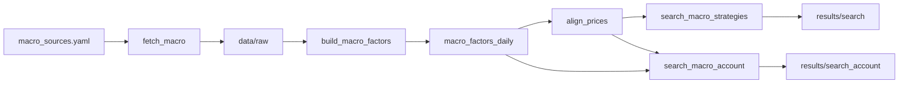

# 宏观因子 × 超级大宗（黄金 / 白银 / 原油）

用**世界性宏观特征**（美元、美债利率、加息压力代理、失业率、CPI、VIX 等）研究预测国内期货 **AU / AG / SC**。  
简单规则策略，优化目标：**Sharpe 高、回撤可控、IC / IR 可用**。

代码：`macro/code/`  
配置：`macro/config/macro_sources.yaml`  
结果：`macro/data/results/`（搜索见 `search/`）

---

## 1. 目标与边界

**标的（研究口径）**：沪金 AU、沪银 AG、INE 原油 SC。  
**标的（账户搜索口径）**：扩展至贵金属 / 能源 / 有色 / 黑色 / 化工 / 农产品等约 33 个国内期货品种（见 §7）。

**宏观特征（已拉取）**

| 名称 | 来源 | 含义 |
|------|------|------|
| `dxy` | Yahoo `DX-Y.NYB` | 美元指数 |
| `usd_broad` | FRED `DTWEXBGS` | 贸易加权美元 |
| `us_2y` / `us_10y` | FRED | 美债 2Y / 10Y |
| `us_curve_10y2y` | FRED | 10Y–2Y 利差 |
| `hike_proxy` | 派生：`us_2y − fed_funds_daily` | **加息/紧缩压力代理**（非 CME 点阵图原文） |
| `fed_funds` / `fed_funds_daily` | FRED | 联邦基金利率 |
| `us_unemp` | FRED `UNRATE` | 美国失业率 |
| `us_cpi` / `cpi_yoy` | FRED CPI | 通胀与同比 |
| `vix` | FRED `VIXCLS` | 波动率 |

派生合成因子：`usd_hawkish = dxy_z60 + hike_proxy_z60`；`risk_off = vix_z60 + dxy_z60`。

说明：CME FedWatch「点阵图概率」需专有接口/爬虫，本版用 **2Y−政策利率** 作为可复现的市场隐含紧缩压力；文档与配置中保留日后替换为真实 FedWatch 概率的位置。

**研究口径不做**：账户层 blotter。  
**账户口径另做**：见 §7（300 万、保证金、手续费、整数手、每日品种上限）。

---

## 2. 流水线



```bash
cd /home/workspace/lab/UniFutures
python3 macro/code/fetch_macro.py
python3 macro/code/build_macro_factors.py
python3 macro/code/align_prices.py
python3 macro/code/search_macro_strategies.py
# 账户口径大规模搜索（可 resume）
python3 macro/code/search_macro_account.py --minutes 75
python3 macro/code/search_macro_account.py --minutes 40 --resume --skip-phase-a
```

对齐规则：宏观因子 **T-1** 再 merge 到交易日；收益为主力合约次日 log return。

---

## 3. IC / IR 与筛选

| 指标 | 可用 | 较好 |
|------|------|------|
| \|IC\| | ≥0.02–0.03 | ≥0.05 |
| IR（月度 IC） | ≥0.1–0.2 | ≥0.3 |

**Robust 门槛（摘要）**：Sharpe≥0.6，时间对半两边 Sharpe>0，IR5≥0.1，\|IC5\|≥0.02，maxDD≥−25%。

---

## 4. 搜索结论（约 2018-01 → 2026-09）

产出：`macro/data/results/search/search_report.json`。

| 统计 | 数值 |
|------|------|
| 方案数 | ~数千（分品种网格） |
| robust | **25**（AU 20 + SC 5；AG 未进 robust） |
| soft | **78** |

### 4.1 因子预测力（全样本 IC/IR，节选）

| 品种 | 因子 | 方向 | horizon | IC | IR |
|------|------|------|---------|-----|-----|
| AU | `usd_hawkish` | +1 | 1d | 0.014 | **0.64** |
| AU | `dxy_z60` | +1 | 1d | 0.015 | **0.56** |
| AU | `dxy_z60` | +1 | 5d | 0.041 | **0.51** |
| AU | `usd_broad_z60` | +1 | 5d | 0.048 | 0.44 |
| AG | `dxy_z60` | +1 | 1d | −0.01 | 0.44 |
| SC | `cpi_yoy_z60` | +1 | 5d | 0.061 | 0.17 |

解读：黄金上 **美元/紧缩压力类因子的月度 IR 很稳**（>0.5），但日频 IC 绝对值不大（~0.02–0.04）；方向为 +1 表示「美元偏强/偏鹰时金价后续收益略偏正」——与危机期 USD+黄金同涨等机制相容，**不等于**教科书「美元涨、黄金跌」的简单线性。原油更贴 **通胀同比异常**。

### 4.2 定稿分品种规则（Picked）

| 品种 | 因子 | 规则 | Sharpe | maxDD | IC5 | IR5 | 对半 Sharpe |
|------|------|------|--------|-------|-----|-----|-------------|
| AU | `dxy_z60` | long_only thr=1.5 hold=1 dir=+1 | **0.83** | **−8.9%** | 0.041 | **0.51** | 两边为正 |
| AG | `dxy_z60` | 同上（soft） | 0.50 | −17.0% | −0.009 | 0.41 | 两边为正 |
| SC | `cpi_yoy_z60` | sign thr=1.0 hold=1 dir=+1 | **0.98** | −22.2% | 0.061 | 0.17 | 两边为正 |

**三品种等权 book**

| 指标 | 数值 |
|------|------|
| Sharpe | ≈ **1.10** |
| 前半 / 后半 | ≈ 1.25 / 0.95（均 >0） |
| maxDD | ≈ **−12.0%** |
| 累计 log 收益 | ≈ 0.82 |

备选（AU）：`hike_proxy_chg` 连续仓 Sharpe≈1.0、maxDD≈−0.9%，但 IC5 很弱（~0.006）——更像低换手平滑，预测力不如 `dxy_z60`。

---

## 5. 账户口径大规模搜索（300 万）

与 `final_scheme` 精神对齐的约束：

| 约束 | 设定 |
|------|------|
| 启动资金 | **300 万** |
| 保证金 | 券商口径 `lot_margin` |
| 手续费 | `shouxufei` 开平 |
| 手数 | **整数手** |
| 每日持仓品种上限 | 网格 `max_names ∈ {1,2,3,4,6}` |
| 单腿保证金帽 | 可选 5万 / 8万 / 12万 / 20万 / 不限 |
| 资金利用率 | `util ∈ {0.08…0.45}` |
| 品种宇宙 | ~33 个（AU/AG/SC + 有色/能源/黑色/化工/农产等） |

**不是训练模型**：只扫规则参数（因子、阈值、持有期、品种池、仓位）。  
代码：`macro/code/search_macro_account.py`  
结果：`macro/data/results/search_account/`  
日线镜像：`data/infer/results/daily/linear/macro_account_best_daily.csv`（按 **quality** 最优落盘）

搜索规模（含 resume）：有效试探约 **7.9 万**，去重约 **1.2 万**，robust 约 **770**。  
规则模式含义：

| mode | 含义 |
|------|------|
| `long_only` | 因子×方向 ≥ thr 才开多，否则空仓 |
| `sign` | \|因子\| ≥ thr 时按 `sign(因子)×direction` 开多/空 |
| `cont` | 连续仓位（z 截断到 ±2 后归一），可正可负 |

---

## 6. 账户口径候选方案说明

下列方案均约 **2018-01 → 2026-09**，账户口径回测。  
**落盘默认** = 方案 A（quality 最高）；夏普最高 = 方案 B。

### 6.1 方案 A — 美元广度 × 只做黄金（落盘最优）

| 项 | 值 |
|----|-----|
| 因子 | `usd_broad_z60`（贸易加权美元 60 日 z） |
| 规则 | `long_only` thr=**0.25** dir=+1 hold=**5** |
| 品种 | **AU only** |
| 仓位 | util=0.35，max_lots=2，margin_cap=20万，max_names=2 |
| Sharpe | **1.318**（前半 0.72 / 后半 1.76） |
| 累计收益 / maxDD | +35.6% / **−3.7%** |
| 有仓天数 / 均保证金 | 1132 / ~18.6 万 |
| 最差单日 | ~−4.9 万 |

**策略一句话**：美元广度 z 足够偏强时，用约三成多资金整数手做多沪金，持有约一周。干净、回撤小；经济叙事上「美元强→做多金」偏经验规则，不作因果解释。

日线：`search_account/best_account_daily.csv`、`macro_account_best_daily.csv`。

---

### 6.2 方案 B — 美元偏鹰 × BU/NR/M/AU（夏普最高）

| 项 | 值 |
|----|-----|
| 因子 | `usd_hawkish = dxy_z60 + hike_proxy_z60` |
| 规则 | `long_only` thr=**1.0** dir=+1 hold=**3** |
| 品种池 | **BU, NR, M, AU**（每天最多开 2 个） |
| 仓位 | util=0.35，max_lots=2，margin_cap=20万 |
| Sharpe | **1.337**（1.11 / 1.54） |
| 累计收益 / maxDD | +33.9% / **−3.1%** |
| 有仓 / 均保证金 | 975 / ~17.9 万 |

**策略一句话**：美元偏强且加息压力偏鹰时，在沥青 / 20号胶 / 豆粕 / 黄金里按信号强度挑最多两条做多，持有约 3 日。夏普全场最高，池子较杂，可解释性弱于 A/C。

---

### 6.3 方案 C — VIX 变化 × 铜/EG/原油/棉花/金

| 项 | 值 |
|----|-----|
| 因子 | `vix_chg`（VIX 日变化） |
| 规则 | `sign` thr=**2.0** dir=**−1** hold=**15** |
| 品种池 | **CU, EG, SC, CF, AU**（每天最多 3 个） |
| 仓位 | util=**0.12**，max_lots=3，margin_cap=**8万** |
| Sharpe | **1.243**（1.35 / 1.14） |
| 累计收益 / maxDD | +35.1% / −4.2% |
| 有仓 / 均保证金 | 1307 / ~13.9 万 |

**策略一句话**：VIX 日变化绝对值很大时才交易；方向取反（大涨偏空池内、大跌偏多），持有约三周，仓位很轻。偏「恐慌冲击后的风险偏好轮动」。

---

### 6.4 方案 D — 美元偏鹰 × 金银油

| 项 | 值 |
|----|-----|
| 因子 | `usd_hawkish` |
| 规则 | `long_only` thr=**0.25** dir=+1 hold=**3** |
| 品种池 | **AU, AG, SC** |
| 仓位 | util=**0.45**，max_lots=3，margin_cap=20万，max_names=6 |
| Sharpe | **1.191**（0.91 / 1.44） |
| 累计收益 / maxDD | **+123.6%** / **−25.8%** |
| 有仓 / 均保证金 | 1206 / ~67.7 万 |
| 最差单日 | ~−16.9 万 |

**策略一句话**：经典超级大宗篮子；美元偏鹰时分散做多金银油。收益高但回撤与单日亏损明显大于纯金方案，偏进攻。

---

### 6.5 方案 E — VIX 水平 × PVC/铁矿/棉花（不含金）

| 项 | 值 |
|----|-----|
| 因子 | `vix_z60` |
| 规则 | `cont` dir=**−1**（VIX 偏高偏空、偏低偏多），每日调仓 |
| 品种池 | **V, I, CF** |
| 仓位 | util=0.45，max_lots=3，margin_cap=12万 |
| Sharpe | **1.178**（1.32 / 1.02） |
| 累计收益 / maxDD | +36.2% / −7.2% |
| 有仓 | **几乎全样本**（2111 天），均保证金 ~8.4 万 |

**策略一句话**：用波动率高低对化工 / 黑色 / 棉花做连续敞口，离开贵金属主线。

---

### 6.6 方案 F — CPI 同比 × 只做原油

| 项 | 值 |
|----|-----|
| 因子 | `cpi_yoy_z60` |
| 规则 | `sign` thr=**1.25** dir=+1 hold=**2** |
| 品种 | **SC only** |
| 仓位 | util=0.12，max_lots=2，margin_cap=20万 |
| Sharpe | **1.128**（1.63 / 0.75） |
| 累计收益 / maxDD | +47.5% / −5.4% |
| 有仓 / 均保证金 | **490** / ~27.2 万 |

**策略一句话**：美国 CPI 同比 z 足够极端时短线做多原油；交易稀疏，单腿宏观油价。

---

### 6.7 方案对照

| 方案 | 品种 | Sharpe | maxDD | 风格 |
|------|------|--------|-------|------|
| A（落盘） | AU | 1.32 | −3.7% | 干净、低回撤 |
| B（夏普王） | BU,NR,M,AU | **1.34** | −3.1% | 多品种、池子杂 |
| C | CU,EG,SC,CF,AU | 1.24 | −4.2% | VIX 冲击、轻仓长持 |
| D | AU,AG,SC | 1.19 | −25.8% | 金银油进攻 |
| E | V,I,CF | 1.18 | −7.2% | 无金、波动率连续 |
| F | SC | 1.13 | −5.4% | 通胀→原油 |

产物索引：

- `account_search_report.json` — 摘要与 quality 最优  
- `top50_account.csv` / `robust_account.csv` / `all_account_schemes.csv`  
- `best_account_daily.csv` — 方案 A 日线  

若要导出 B–F 日线，用同一 `BookEngine.run_full` 按上表参数重放即可。

---

## 7. 风险与后续

1. 网格 + 时间对半 ≠ 严格 walk-forward；账户搜索亦有多重试探偏差。  
2. 研究口径（§4）无手续费/保证金；账户口径（§5–6）已计入，但未做 BOOK 叠加 / 与 final_scheme 同池竞争测试。  
3. 长时搜索曾出现 Python segfault，已用 checkpoint + `--resume` 续跑；结果以落盘 CSV/JSON 为准。  
4. AG 在研究口径未进 robust；账户口径金银油（方案 D）回撤大，实盘需降杠杆。  
5. 接入真实 **FedWatch 加息概率** 后，替换 `hike_proxy` 重跑即可。  
6. 可与天气线 / 新闻线做容量门控合并（参考 news dual-gated），本文件暂不合并。

---

## 8. 一句话

宏观侧以 **美元 / 紧缩代理 / 通胀 / VIX** 为主：研究口径三品种等权 book Sharpe≈1.1；账户口径（300 万）落盘为 **美元广度阈值做多黄金**（Sharpe≈1.32、回撤≈−3.7%），另有金银油、VIX 多品种、CPI→原油等候选（Sharpe≈1.13–1.34）。全程规则搜索，无神经网络训练。
