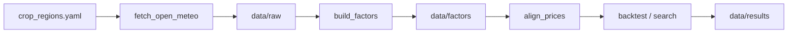

# 国内天气 × 农产品策略方案

研究线：用**中国主产区天气异常**驱动**国内定价主导**的农产品期货信号（棉花 / 白糖 / 苹果 / 红枣）。  
口径为研究回测（`signal × log fwd_ret`），非正式账户 blotter（无保证金/手续费账户层）。

相关代码：`weather/code/`  
配置：`weather/config/crop_regions.yaml`  
结果：`weather/data/results/`（搜索见 `search/`）

---

## 1. 目标与边界

**要做**

- 国内主产区日值天气 → 产区加权因子 → 对齐主力合约收益 → 规则/网格搜索  
- 用 Sharpe、IC、IR、时间对半共同筛选，避免「只看夏普」

**不做**

- 大豆、豆粕、棕榈等外盘主导品种；玉米暂不做（进口+政策扰动大）  
- 不爬需登录的 CMA 大批量历史（Open-Meteo 先跑通；schema 预留 CMA）  
- 不与 `final_scheme` / 新闻线组合门控（天气线独立）

---

## 2. 品种与产区

| 代码 | 品种 | 主产区代表点 | 物候窗（配置） |
|------|------|--------------|----------------|
| CF | 棉花 | 石河子 / 阿克苏 / 库尔勒 | 4–10 月 |
| SR | 白糖 | 崇左 / 南宁 / 临沧 | 5–3 月（跨年） |
| AP | 苹果 | 洛川 / 栖霞 | 3–10 月 |
| CJ | 红枣 | 若羌 / 阿克苏 | 5–10 月 |

站点经纬度与权重见 [`../config/crop_regions.yaml`](../config/crop_regions.yaml)。

---

## 3. 数据与流水线



| 步骤 | 脚本 | 说明 |
|------|------|------|
| 抓取 | `fetch_open_meteo.py` | Open-Meteo Archive：tmin/tmax/tmean、降水、湿度；2015→近；断点续传 |
| 因子 | `build_factors.py` | 产区加权；同日历日气候态 z；GDD、连续干旱、霜冻/热干标记 |
| 对齐 | `align_prices.py` | 主力 `fwd_ret`；天气 **T-1** 再挂交易日（防偷看） |
| 基线回测 | `backtest_weather.py` | 朴素「物候应激→偏多」 |
| 搜索 | `search_weather_strategies.py` / `search_weather_phase2.py` | 多因子×方向×阈值×持有；IC/IR；时间对半 |

### 主要因子

- `tmean_z` / `precip_z` / `tmax_z` / `tmin_z` / `rh_z` / `gdd_z`  
- 滚动：`*_ma5`、`*_ma10`  
- 组合：`dry_hot`、`wet_cool`、`heat_minus_precip`、`frost_score`  
- 截面：`dry_hot_cs` 等（四品种日内分位）

---

## 4. IC / IR 怎么读

日频期货单因子常见参照：

| 指标 | 较弱 | 可用 | 较好 |
|------|------|------|------|
| \|IC\|（与未来收益 Spearman） | <0.02 | 0.02–0.05 | ≥0.05（>0.10 很强，需防过拟合） |
| IR（月度 IC 均值/标准差） | <0.1 | 0.1–0.3 | ≥0.3 |

本方案筛选习惯：

- **过关参考**：\|IC\|≥0.03 且 IR≥0.2，并看时间对半  
- **优先**：5 日收益上的 IC5 / IR5（天气冲击往往不是单日兑现）  
- **不信**：Sharpe 很高但 IC≈0（稀疏事件撞运气）

---

## 5. 实验结论（样本：约 2018-01 → 2026-09）

### 5.1 分层结果

| 层级 | 结论 |
|------|------|
| 朴素应激→做多 | Sharpe 为负，不可用 |
| Phase1 等权书大网格 | 最高 Sharpe≈0.83，但 IC≈0，偏噪音 |
| Phase2 分品种 + 时间对半 | robust **21** / soft **132**；优选组合 book Sharpe≈**1.41** |

Robust 门槛（摘要）：Sharpe≥0.6，前后半 Sharpe 都 >0，全样本 IR5≥0.1，\|IC5\|≥0.02。

### 5.2 定稿分品种规则（Picked）

来源：`data/results/search/phase2_summary.json`、日频 `picked_book_daily.csv` / `picked_legs_daily.csv`。

| 品种 | 因子 | 规则 | Sharpe | 前半/后半 | IC5 | IR5 |
|------|------|------|--------|-----------|-----|------|
| CF | `tmean_z_ma5` | 物候窗；`sign` thr=0.5；**direction=-1**；hold=5（偏冷→空） | 0.68 | 0.01 / 1.24 | 0.14 | 0.25 |
| SR | `tmean_z_ma10` | `sign` thr=1.5；direction=+1；hold=10（偏热→多） | 0.72 | 0.73 / 0.76 | 0.13 | 0.33 |
| AP | `tmean_z_ma5` | 物候窗；`long_only` thr=1.5；dir=+1；hold=10 | 0.77 | 1.18 / 0.36 | 0.08 | 0.09 |
| CJ | `tmean_z_ma10` | `sign` thr=1.5；dir=+1；hold=5 | 0.87 | 0.89 / 0.87 | 0.02 | 0.12 |

**四品种等权 book**（各腿按上表独立出信号，再按日等权）：

| 指标 | 数值 |
|------|------|
| Sharpe | ≈ **1.41** |
| 时间对半 | ≈ 1.32 / 1.51（分界约 2022-05-12） |
| 累计 log 收益 | ≈ 0.54 |

### 5.4 2024+ 衰减与袖套 v2（组合用）

组合回测对齐窗口 **2024-03→2026-09** 时，v1 四品种等权 book 研究夏普从全样本 **1.41** 掉到 **~0.12**（不是 50 万名义缩放算错）。

**原因**

| 腿 | 2024–2026 研究 Sharpe | 说明 |
|----|----------------------|------|
| CF | **−0.62** | thr=0.5 过松、交易密；且历史前半 Sharpe≈0，近端拖垮 EW book |
| AP | +0.63 | 仍可用 |
| SR | +1.16 | 最好，但交易稀疏 |
| CJ | ~0 | 近端贡献弱 |

全样本高夏普主要由 **2020–2023** 贡献；2025 棉花腿大亏把等权书打成负。

**修复（袖套 v2）**：去掉脆弱 CF 默认腿，改用更严棉花规则（`sign` thr=**1.5**，两半段均为正）+ **SR + AP**。

| | v1（CF thr0.5 + SR/AP/CJ） | v2（CF thr1.5 + SR + AP） |
|--|---------------------------|---------------------------|
| 全样本 Sharpe | 1.41 | ≈ **1.18** |
| 2024+ Sharpe | **0.12** | ≈ **1.05** |
| 组合窗代理盈亏（×50万） | 0.7 万 / Sh 0.18 | **4.3 万 / Sh 1.03** |
| 组合（dual+宏观+天气）Sh | 2.79 | **3.02** |

产物：`picked_book_daily_v2.csv`、`picked_legs_daily_v2.csv`、`picked_schemes_v2.json`、`weather_sleeve_v2_report.json`。  
组合侧：`data/infer/results/daily/linear/combo_core_sat/combo_daily_weather_v2.csv`。

建议：进多策略组合时用 **v2**；v1 仅作历史 phase2 存档。CF 若保留，必须 thr≥1.5 且监控近 1 年腿夏普，跌破阈值则权重降为 0。

### 5.4b Phase3 再搜索 → 袖套 v3（更优）

脚本：`weather/code/search_weather_phase3.py`（扩大网格 + **显式优化 2024+ Sharpe** + book 组合搜索）。

| | v1 | v2 | **v3** |
|--|----|----|--------|
| 全样本 Sharpe | 1.41 | 1.18 | ≈ **1.43** |
| 2024+ Sharpe | 0.12 | 1.05 | ≈ **2.27** |
| 组合窗天气代理 Sh | 0.18 | 1.03 | ≈ **2.25** |
| 四策略组合 Sh | 2.79 | 3.02 | ≈ **3.49** |

**v3 定稿腿**

| 品种 | 因子 | 规则 | 全样本 / 2024+ |
|------|------|------|----------------|
| AP | `tmean_z_ma10` | 物候；`sign` thr=1.25 hold=15 dir=+1 | 1.10 / 1.27 |
| CF | `tmean_z_ma5` | 物候；`sign` thr=**1.5** hold=5 dir=−1 | 0.68 / 0.68 |
| SR | `tmean_z_ma5` | 物候；`long_only` thr=1.0 hold=15 dir=+1 | 0.62 / 1.01 |
| CJ | `neg_precip_z` | `long_only` thr=1.0 hold=15 dir=−1（干旱偏多） | 0.67 / 1.35 |

产物：`picked_book_daily_v3.csv`、`picked_schemes_v3.json`、`phase3_summary.json`。  
组合侧对比见 `combo_core_sat`（用 v3 后组合窗天气代理盈亏约 **13.7 万**，Sh≈2.25）。

### 5.5 纯预测力（不交易）

最强一档：**白糖 `tmean_z_ma10`（direction=+1）**

- 5 日 IC ≈ 0.13，IR ≈ 0.33  
- 10 日 IC ≈ 0.19，IR ≈ 0.41–0.45（物候窗内更高）

棉花物候窗内 **`tmean_z_ma5` direction=-1** 的 5 日 IC ≈ 0.14、IR ≈ 0.25，与交易规则方向一致。

---

## 6. 规则语义（简表）

| mode | 含义 |
|------|------|
| `cont` | 连续仓位：clip(z,-2,2)/2 × direction |
| `sign` | \|z\|≥thr 时取 sign(z)×direction，可 hold 若干交易日 |
| `long_only` | 仅当 z×direction ≥ thr 时持仓 direction（单向） |

`pheno_only=true`：仅在配置物候月内开火。  
`hold`：事件触发后沿原方向再持有 N 个交易日。

---

## 7. 如何复现

```bash
cd /home/workspace/lab/UniFutures

python3 weather/code/fetch_open_meteo.py
python3 weather/code/build_factors.py
python3 weather/code/backtest_weather.py

python3 weather/code/search_weather_strategies.py
python3 weather/code/search_weather_phase2.py
# 全样本 IC/IR 与 picks 汇总见 search/phase2_summary.json
```

关键产物：

| 路径 | 内容 |
|------|------|
| `data/raw/*.parquet` | 站点日值 |
| `data/factors/{CF,SR,AP,CJ}_daily.parquet` | 品种因子 |
| `data/results/aligned_panel.parquet` | 天气+收益对齐面板 |
| `data/results/search/robust_schemes.csv` | 过 robust 门槛方案 |
| `data/results/search/picked_book_daily.csv` | 定稿组合日频 |
| `data/results/search/phase2_summary.json` | 汇总指标 |

---

## 8. 风险与后续

1. **网格优选 + 时间对半 ≠ 严格 walk-forward**；上线前应做滚动样本外。  
2. 研究 PnL 未扣手续费、滑点、保证金与手数约束。  
3. Open-Meteo 为再分析/模式日值，不是国家级台站报；接 CMA 后应用同 schema 重跑因子与搜索。  
4. CF 前半 Sharpe 接近 0，主要靠后半；单腿使用需谨慎，更宜放在组合里。  
5. 可继续：账户层 blotter、与 `final_scheme` 卫星叠加、物候窗按农气日历细化。

---

## 9. 一句话结论

在国内主产区天气因子上，**白糖/棉花的温度异常（5–10 日均 z）** 具备可用的 IC/IR；按分品种定稿规则等权组合后，研究口径 Sharpe 约 **1.4** 且时间对半两边为正。方案可作独立天气研究线，正式交易前需 walk-forward 与账户层验证。
